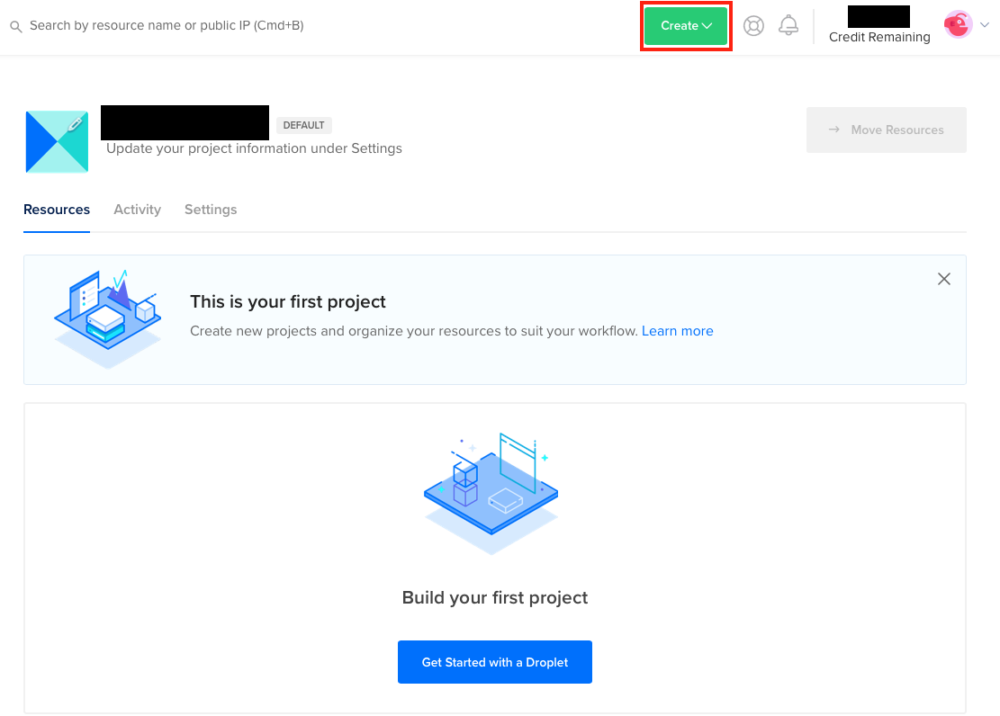

# sandbox
### Required Software
* [Vagrant](https://www.vagrantup.com)
* [Virtualbox](https://www.virtualbox.org/wiki/Downloads)
* [Ansible](https://docs.ansible.com/ansible/latest/installation_guide/intro_installation.html)

### Topology


### Getting Started
* Quick Setup on Digital Ocean: [60 Day Free Trial with $100.00 credit](https://m.do.co/c/b281130338a0)
  * <details><summary>Screen Shots of VM Creation</summary>
      <ul>
        <li></li>
        <li></li>
        <li></li>
        <li></li>
        <li></li>
        <li></li>
      </ul>
    </details>
  * Once logged into the Linux VM run each command in sequence listed:
    * ```apt update```
    * ```apt upgrade -y```
    * ```apt install ansible -y```
    * ```apt install virtualbox -y```
    * ```apt install vagrant -y``` 
    * ```reboot```
    * ```git clone https://github.com/crconte/sandbox.git```
    * ```cd sandbox```
    * ```vagrant up```
    * ```./inventory_setup_linux.sh```
    * ```ansible-playbook setup.yml```
* Setup time is approximately **~9 minutes** if all above requirements are met.
  * Clone the directory `git clone git@github.comcast.com:DCS/sandbox.git`
  * Change directory `cd sandbox`
  * `vagrant up` Takes **~8 minutes** to complete
  * Execute the the following script: Takes **~1 second** to complete
    * `./inventory_setup_linux.sh` **Linux Users**
    * `./inventory_setup_mac.sh` **MAC Users**
  * `ansible-playbook setup.yml` Takes **~1 minute** to complete
  * Wait for **~1 minute** for peers and environment to route

* Quick Troubleshooting FAQ:
  * <details><summary>Occasional hang during ssh process of a node.</summary></details>
  * Option 1:
    * Execute `vagrant halt <problematic node>` Example: `vagrant halt s1g1`
    * Execute `vagrant destroy <problematic node> -f` Example: `vagrant destroy s1g1 -f`
    * Execute `vagrant up <problematic node>` Example: `vagrant up s1g1`
    * You may have to repeat the same step several times.
    * <details><summary>Successful Outcome:</summary></details>
    
* Verification:
  * <details><summary>vagrant status</summary></details>
  * <details><summary>ansible all -m ping</summary></details>
  * <details><summary>c1 ping test</summary></details>

### Configurations
 ### c1
 /etc/netplan/50-cloud-init.yaml
|---------------------------------|
|apply via: **sudo netplan apply**|
<details>
<summary>/etc/netplan/50-cloud-init.yaml</summary>
<pre><code># This file is generated from information provided by the datasource.  Changes
# to it will not persist across an instance reboot.  To disable cloud-init's
# network configuration capabilities, write a file
# /etc/cloud/cloud.cfg.d/99-disable-network-config.cfg with the following:
# network: {config: disabled}
network:
    ethernets:
        enp0s3:
            dhcp4: true
            match:
                macaddress: 02:ad:b8:da:8b:56
            set-name: enp0s3
        enp0s8:
            dhcp4: false
            addresses: [10.10.10.10/24]
    version: 2</pre></code>
</details>

 ### c2
 /etc/netplan/50-cloud-init.yaml
|---------------------------------|
|apply via: **sudo netplan apply**|

<details>
<summary>/etc/netplan/50-cloud-init.yaml</summary>
<pre><code># This file is generated from information provided by the datasource.  Changes
# to it will not persist across an instance reboot.  To disable cloud-init's
# network configuration capabilities, write a file
# /etc/cloud/cloud.cfg.d/99-disable-network-config.cfg with the following:
# network: {config: disabled}
network:
    ethernets:
        enp0s3:
            dhcp4: true
            match:
                macaddress: 02:ad:b8:da:8b:56
            set-name: enp0s3
        enp0s8:
            dhcp4: false
            addresses: [10.10.10.20/24]
    version: 2</pre></code></details>

 ### s1g1
/etc/sonic/config_db.json
|---------------------------------|
|apply via: **sudo config reload**|

<details>
<summary>/etc/sonic/config_db.json</summary>
<pre><code>{
    "BGP_NEIGHBOR": {
        "192.168.250.1": {
            "rrclient": 0,
            "name": "l1",
            "local_addr": "192.168.250.0",
            "nhopself": 0,
            "holdtime": "10",
            "asn": "65001",
            "keepalive": "3"
        },
        "192.168.250.3": {
            "rrclient": 0,
            "name": "l3",
            "local_addr": "192.168.250.2",
            "nhopself": 0,
            "holdtime": "10",
            "asn": "65002",
            "keepalive": "3"
        }
    },
    "DEVICE_METADATA": {
        "localhost": {
            "hwsku": "Force10-S6000",
            "hostname": "s1g1",
            "platform": "x86_64-kvm_x86_64-r0",
            "mac": "08:00:27:9f:a6:1f",
            "bgp_asn": "65100",
            "type": "spine"
        }
    },
    "DEVICE_NEIGHBOR": {},
    "LOOPBACK_INTERFACE": {
        "Loopback0|192.168.254.51/32": {}
    },
    "INTERFACE": {
        "Ethernet0|192.168.250.0/31": {},
        "Ethernet4|192.168.250.2/31": {}
    },
    "PORT": {
        "Ethernet0": {
            "alias": "E0/0",
            "admin_status": "up",
            "lanes": "29,30,31,32",
            "mtu": "9100"
        },
        "Ethernet4": {
            "alias": "E0/4",
            "admin_status": "up",
            "lanes": "25,26,27,28",
            "mtu": "9100"
        }
    }
}</pre></code></details>

 ### s2g1

/etc/sonic/config_db.json
|---------------------------------|
|apply via: **sudo config reload**|

<details>
<summary>/etc/sonic/config_db.json</summary>
<pre><code>{
    "BGP_NEIGHBOR": {
        "192.168.250.5": {
            "rrclient": 0,
            "name": "l1",
            "local_addr": "192.168.250.4",
            "nhopself": 0,
            "holdtime": "10",
            "asn": "65001",
            "keepalive": "3"
        },
        "192.168.250.7": {
            "rrclient": 0,
            "name": "l3",
            "local_addr": "192.168.250.6",
            "nhopself": 0,
            "holdtime": "10",
            "asn": "65002",
            "keepalive": "3"
        }
    },
    "DEVICE_METADATA": {
        "localhost": {
            "hwsku": "Force10-S6000",
            "hostname": "s2g1",
            "platform": "x86_64-kvm_x86_64-r0",
            "mac": "08:00:27:9f:a6:3f",
            "bgp_asn": "65100",
            "type": "spine"
        }
    },
    "DEVICE_NEIGHBOR": {},
    "LOOPBACK_INTERFACE": {
        "Loopback0|192.168.254.52/32": {}
    },
    "INTERFACE": {
        "Ethernet0|192.168.250.4/31": {},
        "Ethernet4|192.168.250.6/31": {}
    },
    "PORT": {
        "Ethernet0": {
            "alias": "E0/0",
            "admin_status": "up",
            "lanes": "29,30,31,32",
            "mtu": "9100"
        },
        "Ethernet4": {
            "alias": "E0/4",
            "admin_status": "up",
            "lanes": "25,26,27,28",
            "mtu": "9100"
        }
    }
}</pre></code></details>

 ### l1
/etc/network/interfaces
|-------------------------------|
|apply via: **sudo ifreload -a**|

<details>
<summary>/etc/network/interfaces</summary>
<pre><code># This file describes the network interfaces available on your system
# and how to activate them. For more information, see interfaces(5).

source /etc/network/interfaces.d/*.intf

\# The loopback network interface
auto lo
iface lo inet loopback
    # The primary network interface
    address 192.168.254.1/32
    vxlan-local-tunnelip 192.168.254.1

\# The primary network interface
auto eth0
iface eth0 inet dhcp
    vrf mgmt

auto swp1
iface swp1
    bridge-access 10
    mstpctl-bpduguard yes
    mstpctl-portadminedge yes

auto swp2
iface swp2
    address 192.168.250.1/31

auto swp3
iface swp3
    address 192.168.250.5/31

auto mgmt
iface mgmt
    address 127.0.0.1/8
    address ::1/128
    vrf-table auto

auto bridge
iface bridge
    bridge-ports swp1 vni10
    bridge-vids 10
    bridge-vlan-aware yes

auto vni10
iface vni10
    bridge-access 10
    vxlan-id 10
    mstpctl-portbpdufilter yes
    mstpctl-bpduguard yes
    bridge-learning off
    bridge-arp-nd-suppress on

auto vlan10
iface vlan10
    vlan-raw-device bridge
    vlan-id 10
    ip-forward off
    ip6-forward off</pre></code></details>

/etc/frr/frr.conf
|-----------------------------------------|
|apply via: **sudo systemctl restart frr**|

<details>
<summary>/etc/frr/frr.conf</summary>
<pre><code>frr version 7.4+cl4.2.1u1
frr defaults datacenter
hostname l1
log syslog informational
service integrated-vtysh-config
!
router bgp 65001
 no bgp default ipv4-unicast
 neighbor evpn peer-group
 neighbor evpn ebgp-multihop 3
 neighbor evpn update-source lo
 neighbor spine peer-group
 neighbor spine remote-as 65100
 neighbor 192.168.254.3 remote-as 65002
 neighbor 192.168.254.3 peer-group evpn
 neighbor 192.168.250.0 peer-group spine
 neighbor 192.168.250.4 peer-group spine
 !
 address-family ipv4 unicast
  network 192.168.254.1/32
  neighbor spine activate
 exit-address-family
 !
 address-family l2vpn evpn
  neighbor evpn activate
  advertise-all-vni
 exit-address-family
!
line vty
!</pre></code></details>

/etc/frr/daemons
|-----------------------------------------|
|apply via: **sudo systemctl frr restart**|

<details>
<summary>/etc/frr/daemons</summary>
<pre><code># This file tells the frr package which daemons to start.
#
# Entries are in the format: <daemon>=(yes|no|priority)
#   0, "no"  = disabled
#   1, "yes" = highest priority
#   2 .. 10  = lower priorities
# Read /usr/share/doc/frr/README.Debian for details.
#
# Sample configurations for these daemons can be found in
# /usr/share/doc/frr/examples/.
#
# ATTENTION:
#
# When activating a daemon for the first time, a config file, even if it is
# empty, has to be present *and* be owned by the user and group "frr", else
# the daemon will not be started by /etc/init.d/frr. The permissions should
# be u=rw,g=r,o=.
# When using "vtysh" such a config file is also needed. It should be owned by
# group "frrvty" and set to ug=rw,o= though. Check /etc/pam.d/frr, too.
#
# The watchfrr daemon is always started. Per default in monitoring-only but
# that can be changed.
#
bgpd=yes
ospfd=no
ospf6d=no
ripd=no
ripngd=no
isisd=no
fabricd=no
pimd=no
ldpd=no
nhrpd=no
eigrpd=no
babeld=no
sharpd=no
pbrd=no
fabricd=no
vrrpd=no

\#
\# If this option is set the /etc/init.d/frr script automatically loads
\# the config via "vtysh -b" when the servers are started.
\# Check /etc/pam.d/frr if you intend to use "vtysh"!
\#
vtysh_enable=yes
zebra_options="  -M cumulus_mlag -M snmp -A 127.0.0.1 -s 90000000"
bgpd_options="   -M snmp -A 127.0.0.1"
ospfd_options="  -M snmp -A 127.0.0.1"
ospf6d_options=" -M snmp -A ::1"
ripd_options="   -A 127.0.0.1"
ripngd_options=" -A ::1"
isisd_options="  -A 127.0.0.1"
pimd_options="   -A 127.0.0.1"
ldpd_options="   -A 127.0.0.1"
nhrpd_options="  -A 127.0.0.1"
eigrpd_options=" -A 127.0.0.1"
babeld_options=" -A 127.0.0.1"
sharpd_options=" -A 127.0.0.1"
pbrd_options="   -A 127.0.0.1"
staticd_options="-A 127.0.0.1"
fabricd_options="-A 127.0.0.1"
vrrpd_options="  -A 127.0.0.1"

\# configuration profile
\#
\#frr_profile="traditional"
\#frr_profile="datacenter"

\#
\# This is the maximum number of FD's that will be available.
\# Upon startup this is read by the control files and ulimit
\# is called.  Uncomment and use a reasonable value for your
\# setup if you are expecting a large number of peers in
\# say BGP.
\#MAX_FDS=1024

\# The list of daemons to watch is automatically generated by the init script.
\#watchfrr_options=""

\# for debugging purposes, you can specify a "wrap" command to start instead
\# of starting the daemon directly, e.g. to use valgrind on ospfd:
\#   ospfd_wrap="/usr/bin/valgrind"
\# or you can use "all_wrap" for all daemons, e.g. to use perf record:
\#   all_wrap="/usr/bin/perf record --call-graph -"
\# the normal daemon command is added to this at the end.</pre></code></details>

 ### l3
/etc/network/interfaces
|-------------------------------|
|apply via: **sudo ifreload -a**|
<details>
<summary>/etc/network/interfaces</summary>
<pre><code># This file describes the network interfaces available on your system
# and how to activate them. For more information, see interfaces(5).

source /etc/network/interfaces.d/*.intf

\# The loopback network interface
auto lo
iface lo inet loopback
    \# The primary network interface
    address 192.168.254.3/32
    vxlan-local-tunnelip 192.168.254.3

\# The primary network interface
auto eth0
iface eth0 inet dhcp
    vrf mgmt

auto swp1
iface swp1
    bridge-access 10
    mstpctl-bpduguard yes
    mstpctl-portadminedge yes

auto swp2
iface swp2
    address 192.168.250.3/31

auto swp3
iface swp3
    address 192.168.250.7/31

auto mgmt
iface mgmt
    address 127.0.0.1/8
    address ::1/128
    vrf-table auto

auto bridge
iface bridge
    bridge-ports swp1 vni10
    bridge-vids 10
    bridge-vlan-aware yes

auto vni10
iface vni10
    bridge-access 10
    vxlan-id 10
    mstpctl-portbpdufilter yes
    mstpctl-bpduguard yes
    bridge-learning off
    bridge-arp-nd-suppress on

auto vlan10
iface vlan10
    vlan-raw-device bridge
    vlan-id 10
    ip-forward off
    ip6-forward off</pre></code></details>

/etc/frr/frr.conf
|-----------------------------------------|
|apply via: **sudo systemctl restart frr**|
<details>
<summary>/etc/frr/frr.conf</summary>
<pre><code>frr version 7.4+cl4.2.1u1
frr defaults datacenter
hostname l3
log syslog informational
service integrated-vtysh-config
router bgp 65002
 no bgp default ipv4-unicast
 neighbor evpn peer-group
 neighbor evpn ebgp-multihop 3
 neighbor evpn update-source lo
 neighbor spine peer-group
 neighbor spine remote-as 65100
 neighbor 192.168.254.1 remote-as 65001
 neighbor 192.168.254.1 peer-group evpn
 neighbor 192.168.250.2 peer-group spine
 neighbor 192.168.250.6 peer-group spine
 !
 address-family ipv4 unicast
  network 192.168.254.3/32
  neighbor spine activate
 exit-address-family
 !
 address-family l2vpn evpn
  neighbor evpn activate
  advertise-all-vni
 exit-address-family
line vty</pre></code></details>

/etc/frr/daemons
|-----------------------------------------|
|apply via: **sudo systemctl frr restart**|

<details>
<summary>/etc/frr/daemons</summary>
<pre><code># This file tells the frr package which daemons to start.
#
# Entries are in the format: <daemon>=(yes|no|priority)
#   0, "no"  = disabled
#   1, "yes" = highest priority
#   2 .. 10  = lower priorities
# Read /usr/share/doc/frr/README.Debian for details.
#
# Sample configurations for these daemons can be found in
# /usr/share/doc/frr/examples/.
#
# ATTENTION:
#
# When activating a daemon for the first time, a config file, even if it is
# empty, has to be present *and* be owned by the user and group "frr", else
# the daemon will not be started by /etc/init.d/frr. The permissions should
# be u=rw,g=r,o=.
# When using "vtysh" such a config file is also needed. It should be owned by
# group "frrvty" and set to ug=rw,o= though. Check /etc/pam.d/frr, too.
#
# The watchfrr daemon is always started. Per default in monitoring-only but
# that can be changed.
#
bgpd=yes
ospfd=no
ospf6d=no
ripd=no
ripngd=no
isisd=no
fabricd=no
pimd=no
ldpd=no
nhrpd=no
eigrpd=no
babeld=no
sharpd=no
pbrd=no
fabricd=no
vrrpd=no

\#
\# If this option is set the /etc/init.d/frr script automatically loads
\# the config via "vtysh -b" when the servers are started.
\# Check /etc/pam.d/frr if you intend to use "vtysh"!
\#
vtysh_enable=yes
zebra_options="  -M cumulus_mlag -M snmp -A 127.0.0.1 -s 90000000"
bgpd_options="   -M snmp -A 127.0.0.1"
ospfd_options="  -M snmp -A 127.0.0.1"
ospf6d_options=" -M snmp -A ::1"
ripd_options="   -A 127.0.0.1"
ripngd_options=" -A ::1"
isisd_options="  -A 127.0.0.1"
pimd_options="   -A 127.0.0.1"
ldpd_options="   -A 127.0.0.1"
nhrpd_options="  -A 127.0.0.1"
eigrpd_options=" -A 127.0.0.1"
babeld_options=" -A 127.0.0.1"
sharpd_options=" -A 127.0.0.1"
pbrd_options="   -A 127.0.0.1"
staticd_options="-A 127.0.0.1"
fabricd_options="-A 127.0.0.1"
vrrpd_options="  -A 127.0.0.1"

\# configuration profile
\#
\#frr_profile="traditional"
\#frr_profile="datacenter"

\#
\# This is the maximum number of FD's that will be available.
\# Upon startup this is read by the control files and ulimit
\# is called.  Uncomment and use a reasonable value for your
\# setup if you are expecting a large number of peers in
\# say BGP.
\#MAX_FDS=1024

\# The list of daemons to watch is automatically generated by the init script.
\#watchfrr_options=""

\# for debugging purposes, you can specify a "wrap" command to start instead
\# of starting the daemon directly, e.g. to use valgrind on ospfd:
\#   ospfd_wrap="/usr/bin/valgrind"
\# or you can use "all_wrap" for all daemons, e.g. to use perf record:
\#   all_wrap="/usr/bin/perf record --call-graph -"
\# the normal daemon command is added to this at the end.</pre></code></details>
